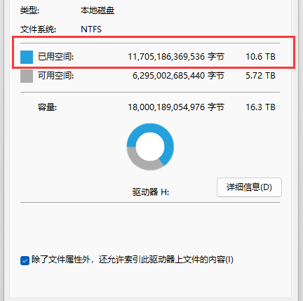
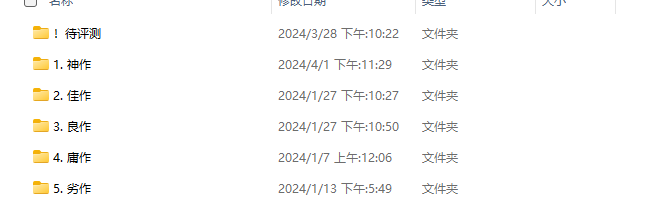
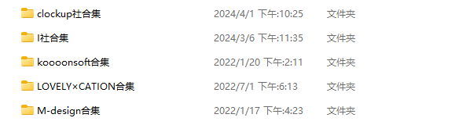

# 需求背景

随着互联网发展，硬件的存储价格不断降低，使得个人拥有大容量存储成为可能。因此也滋生了越来越多的“仓鼠症”。很多仓鼠症患者在收集的资源越来越多的同时，也会发现管理/整合资源的难度越来越高。在多媒体的领域，这个问题尤为严重。
笔者对这个问题也是头疼已久，当资源超过10TB之后，无论是按照种类区分，还是按照常用程度区分，都无法很好地满足笔者的需求。
因此开发一个资源管理器是很有必要的。










## 目标用户定位

1. 拥有强烈仓鼠症的用户
2. 希望以更优雅方式管理软件和媒体的用户

## 📋 功能架构

这是一个"绿色游戏管理器"的功能架构图，旨在提供全面的游戏管理、增强、处理、游戏化、设置、社交和辅助功能。

### 1. 资源管理

* [ ] **从本地****添加资源 (文件索引)**

- [ ] **删除资源**
  - [ ] 仅删除引用
  - [ ] 删除引用和本地文件
- [ ] **更新资源信息**
  - [ ] 引用丢失时提醒
  - [ ] 更改资源目录
- [ ] **资源索引**
  - [ ] tag索引 (支持多tag)
  - [ ] 收藏夹索引 (支持多收藏夹)
  - [X] 游戏时间排序
  - [X] 访问先后排序
  - [ ] 未玩过排序
  - [ ] 猴子排序
  - [ ] 访问次数排序
  - [ ] 作者索引

### 2. 资源加强

- [ ] **应用内运行游戏**
- [ ] **游戏数据记录**
  - [ ] 记录游戏运行时间
  - [ ] 记录游戏运行次数
  - [ ] 记录游戏第一次运行日期
  - [ ] 记录上一次运行日期
- [ ] **游戏截图**
  - [ ] 允许自定义快捷键
- [ ] **评论**
  - [ ] 评论模板
  - [ ] 富文本支持
- [ ] **收集夹**
  - [ ] 允许用户设定一个收集

### 3. 资源处理

- [ ] 自动解压rar和zip*
- [ ] 自动将文件的拓展名修改为rar*
- [ ] 自定义解压码*
- [ ] 自带常用解压码*
- [ ] 一键安装常见的运行环境

### 4. 游戏化

- [ ] 成就系统
- [ ] 养成系统
- [ ] roguelike
  - [ ] 随机本子
  - [ ] 随机游戏 (随机强制打开一个游戏)
- [ ] 玩家个人数据

### 5. 管理器设置

- [ ] 亮色模式/暗色模式
- [ ] 设置开机自启
- [ ] 设置安全键 (一键关闭游戏并打开某个特定的软件)*
- [ ] 贤者模式 (贤者模式下,打开游戏会弹出一些佛学语录)*

### 6. 社群化

- [ ] 登录注册帽子社的账号
- [ ] 允许玩家为某个游戏创建社区
  - [ ] [ ] 同步评论到社区
  - [ ] [ ] 同步游戏tag和名字等信息

### 7. 游戏辅助

- [ ] 游戏攻略
- [ ] 游戏修改器
- [ ] 游戏修改教程

## 技术栈

- **前端框架**: Vue 3
- **构建工具**: Vite
- **桌面框架**: Electron
- **包管理器**: npm
- **开发语言**: JavaScript/TypeScript

## 快速开始

### 安装依赖

```bash
npm install
```

### 开发模式

启动Vue开发服务器

```bash
npm run dev
```

启动Vue开发服务器和Electron：

```bash
npm run electron-dev
```

这将同时启动Vite开发服务器和Electron应用。

### 构建应用

构建Vue应用：

```bash
npm run build
```

构建Electron应用：

```bash
npm run electron-build
```

### 打包分发

创建可分发的应用包：

```bash
npm run dist
```

## 更新日志
